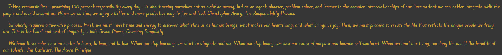

# Inspirtional Ipsum

This version of the Lorem Ipsum, has been created to provide random inspirational quotes. It is aimed at people who need a little 'pick me up' when they are feeling down. What better way than with an inspirational quote. 

Anybody can use Inspirational Ipsum and get their quote of the day. 

Ispiration for this project came from Hipster Ipsum!

The project was made using JavaScript, HTML and CSS. 

---

## Features

* **Header**
The header is a simple HTML header, with some CSS to style it. 

* **Direction Text**
I have added some simple text using HTML, to explain how to use the page, and the use of the buttons (generate/clear).

* **Button**
The button is created using HTML, and is displayed in the centre of the screen underneath the header. It is used to generate the Inspiration Ipsum quotes, between 1-9 quotes.
The clear button is created in HTML, also displayed in the centre of the screen, this allows users to clear the screen before reselcting an number to read different quotes. 

* **Quotes**
The quotes are generated through pressing the submit or 'generate' button, and these will be displayed depending the number of quotes called. If no number is selected, then it will not be possible to view the quotes. A user must select a number. It is also not possible to scroll below 1 or above 9 exceeding the quotes available. 

* **Footer**
The footer is created using HTML and CSS, and is fixed in it's position, it follows the style of the rest of the page, except the colors are reversed to make the footer stand out. The content of the footer, shows my name as the creator of Inspiration Ipsum with a trademark sign. 

* **Color Scheme**

---

* **Header**
The has some HTML and CSS to describe what this page is. 

* **Direction Text**
The direction text allows users to understand how to use the page. It remains fixed on the page so users can always refer to it. 

* **Button**
The 'generate' button has a selector next to it which allows users to choose how many quotes they wish to see. This can be entered using the mouse or keyboard, and the 'generate button can either be clicked using a mouse, or by the using hitting enter on a keyboard. 
The 'clear' button is located below the 'generate' button, and when present below the quotes, it can be activated with a mouse click. 

* **Quotes**
Once the 'generate' button has been pressed, then a number of selected quotes will display. Only numbers between 1 and 9 can be selected, and the result will be the same number of quotes displayed as the number selected.  

* **Footer**
The footer section is a simple footer showing the creator of the page with a copyright mark.

## Testing

* the page has been tested using Chrome and Safari
* The project is working and can continue to generate multiple quotes when required
* All text is readable and understandable

## Validation testing

* HTML
No errors found when using the official W3C validator for pages.html. It did flag 2 classes for section and article which expected to see headers. But as these have been determined as classes, then no header is required. So these have been ignored. 

* CSS
No errors return for CSS using the official W3C CSS Validator for style.css. 

* JavaScript
No errors returned for JavaScript using the offical jshint.com. The page did bring up warnings, but this was for a specific format, and not to do with how the code runs, so these have been ignored.  

* Accessibility 
The colors and fonts chosen read easily and score very well in the dev tools running lighthouse in Chrome

## Bugs

**Solved Bugs**

Issues with the footer moving around the page depending on what CSS was implemented. After some research I found out how to fix it to the bottom so that other text could display in the same way. 

**Unsolved Bugs**

There are no unsolved bugs within the code 

## Deployment

* The site was deployed to GitHub Pages. The Steps to deploy are as follows:
  * In the GitHub repository, navigate to the Settings tab.  
  * Scroll down to the GitHub Pages section and click the 'Check it out here!' link.  
  * From the source section drop-down menu, select the Main branch.  
  * Once the Main branch had been selected, the page provided the link to the completed website. 

  The live link can be found here: [Inspration Ipsum](https://ddrobrien.github.io/inspiration-ipsum-project-2/)

  * The site was created using GitPod and GitHub
  * The site was created using 'git add .'
  * The site was created using 'git commit -m ""' with appropriate messaging
  * The site was created using 'git push' to update the version being worked on

  ## Credits

  ### Content
  * The HTML and JavaScript layout came from a tutorial [40 JavaScript Projects for Beginners](https://www.freecodecamp.org/news/javascript-projects-for-beginners/)
  * The inspiration quotes came from a website [Inspirational Words of Wisdom](wow4u.com/lifeq2/) Each quote is referenced by the author of the quote within the Ipsum itself. 
  * the footer was used from a tutorial by [W3 Schools](https://www.w3schools.com/css/default.asp)
  * Color pallet was collected using [coolers](coolers.co)